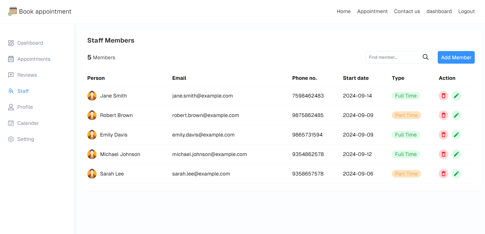
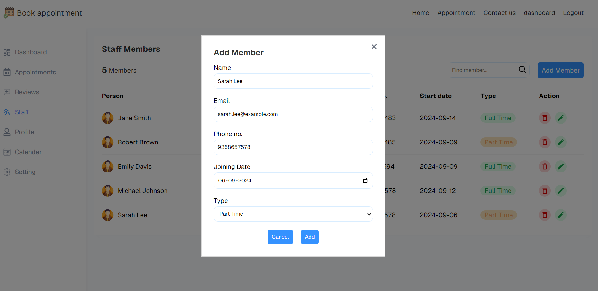

# Booking Appointment Platform

<div align-item="left">
  
  
  
  
<!--    -->
  
  
<!--    -->
  
  
</div>

## Introduction

The Booking Appointment Platform is a comprehensive web application built using the MERN stack (MongoDB, Express.js, React, Node.js) with Redux for state management and RTK Query for API integration. This platform allows users to book appointments, create profiles, manage their schedules, and provide services as professionals. The back-end integrates with MongoDB for user management and Cloudinary for image storage.

## Features
- User Registration and Profile Management: Users can sign up, create profiles, and manage their personal information.
- Appointment Booking: Users can book, view, and cancel appointments online.
- Professional Dashboard: Professionals have access to a dashboard to manage appointments, view earnings (daily, weekly, yearly), and handle client reviews.
- Staff Management: Add, update, search, and delete staff profiles.
- Big Calendar Integration: Provides an overview of all appointments and enables easy scheduling.

## Prerequisites
Before you get started, make sure you have the following installed:

- Node.js
- MongoDB (Ensure it is running)
- Cloudinary Account (For image storage)

## Installation
1. Clone the repository:

   ```bash
   git clone https://github.com/Surajnathani/booking-appointment.git
   
2. Navigate to the client-side project directory: 

    ```bash
    cd /client

3. Install dependencies:
      ```bash
      npm install

4. Open a new terminal, navigate to the server-side project directory:
    ```bash
    cd /server


5. Install dependencies:
      ```bash
      npm install

##  Usage

1. Navigate to the client-side project:
   ```bash
    cd /client
   
2. Run the client-side application:
   ```bash
    npm run dev
   
3. Open a new terminal, navigate to the server-side project directory:
   ```bash
    cd /server
    
4. Run client-code:
   ```bash
    npm run dev

5. Open your browser and go to http://localhost:5173 to access the application.

## Folder Structure
The project structure is organized as follows:

    book-appointment/
    │
    ├── client/              # Frontend code (React)
    │   └── public           # Static assets and HTML template
    ├── src/                 # React application source code
    │   ├── components/      # Reusable React components
    │   ├── pages/           # Individual pages/components
    │   ├── constant/        # Define constant value
    │   ├── redux/           # State management and RTK Query for API integration 
    │   ├── App.jsx          # Main App component
    │   └── index.jsx        # Entry point for the React app
    | 
    ├── server/              # Backend code (Express.js)
    │   ├── routes/          # API routes
    │   ├── controllers/     # Request handlers
    │   ├── middleware/      # Authentication
    │   ├── models/          # MongoDB models
    │   ├── config/          # Configuration files
    |   ├── utils/           # Utility functions or helper modules
    |   ├── constant/        # Define constant value
    |   ├── lib/             # Helper function and form validation
    │   └── server.js        # Entry point for the server application
    └── README.md            # Project documentation

## Technologies Used
- [MongoDB](https://www.mongodb.com/) 
- [Express.js](https://expressjs.com/)
- [React](https://react.dev/)
- [Node.js](https://nodejs.org/en)
- [Cloudinary (for image storage)](https://cloudinary.com/)
